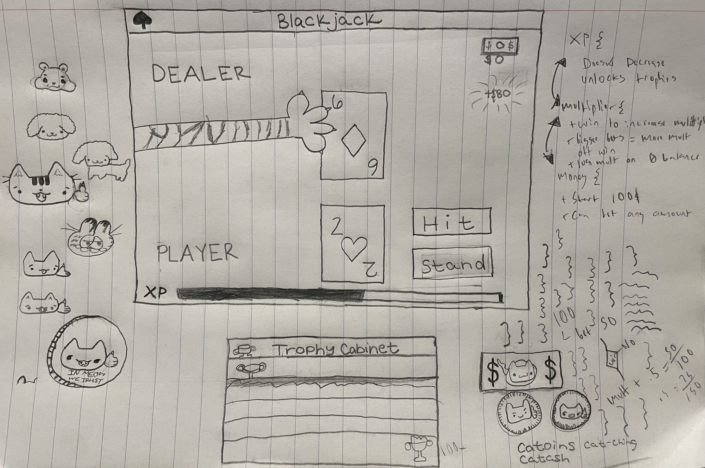

# Blackjack Software Architecture Document
## Summary:
This project is a browser‑based Blackjack game implemented in JavaScript, styled with CSS and Bootstrap, and enhanced with Firebase Authentication and Firestore for persistent user data. The game supports login/registration, XP progression, leveling, betting, and dynamic UI updates. All game logic runs client‑side, with Firestore used to store and retrieve player stats.

## Features:
* Blackjack Gameplay
  - Deck creation, shuffling, card drawing  
  - Player and dealer hands  
  - Hit/Stand logic  
  - Hidden dealer card reveal  
  - Bust, win, loss, tie detection
* Player Progression System
  - XP gain per round
  - Leveling system with XP thresholds
  - Money system with resets on bankruptcy
  - Win/loss tracking
  - Multiplier mechanic that increases XP gain
* User Authentication
  - Login and registration via Firebase Auth
  - Persistent player data stored in Firestore
  - Auto‑loading of player stats on login
* UI & UX
  - Responsive layout using Bootstrap
  - Dynamic card rendering
  - Round‑over modal
  - Login modal
  - XP bar animation
  - Error handling for invalid bets

## Tech Stack:
* Frontend
  - HTML5
  - CSS3 + Bootstrap 5
  - JavaScript ES Modules
* Backend / Cloud
  - Firebase Authentication
  - Firebase Firestore
  - Firebase Analytics
* Hosting
  - GitHub Pages (assumed from repo link)

## Project Structure:
## Architecture
## Class Diagrams
## Sequence Diagram
## Data Model

